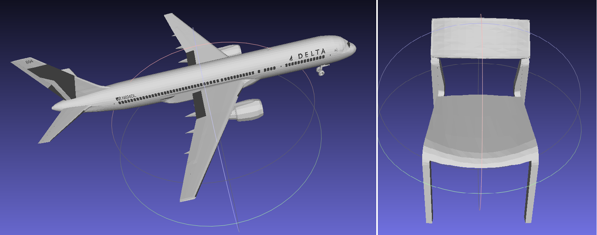
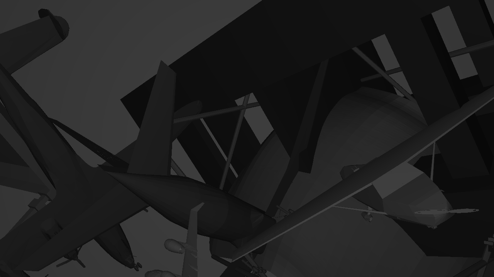
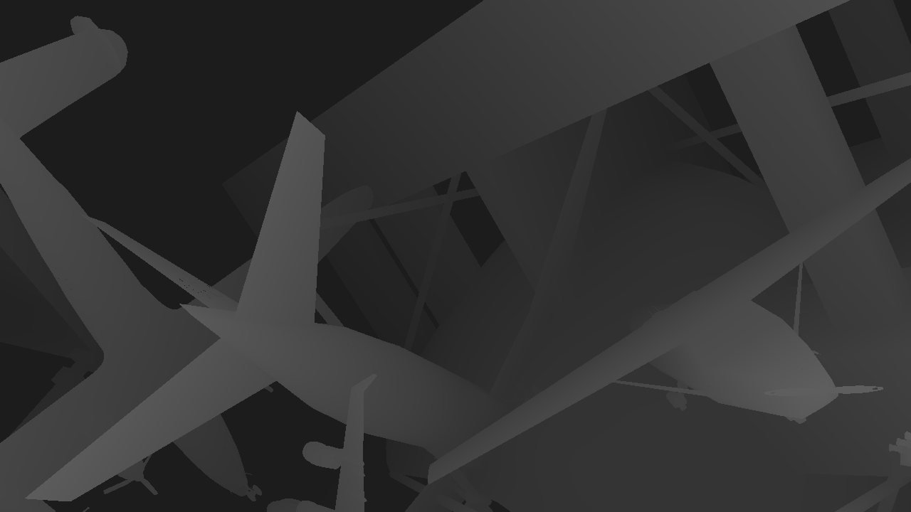
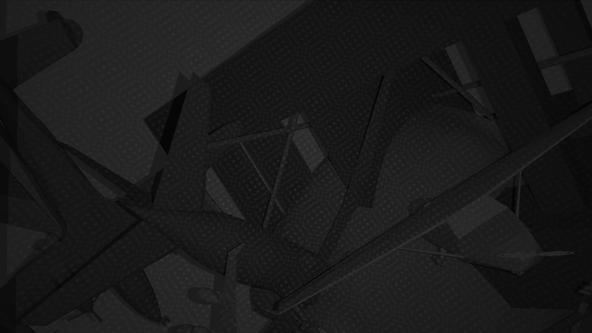
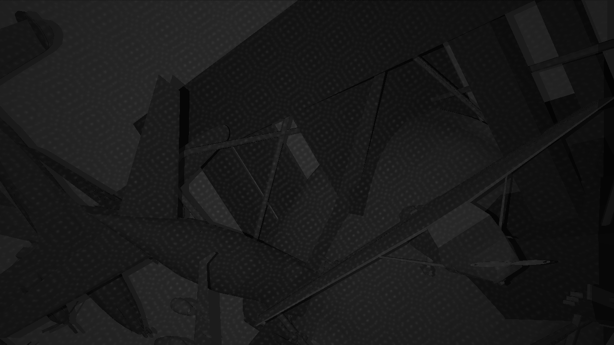

# Make Your Own Active Camera Systems Data

> CNN has made great progress in depth estimation task. At present, the commonly used stereo matching public datasets include Middlebury, Sceneflow and kitti12/15 and so on. If you are interested in depth estimation of active camera systems and want to use deep learning methods to do this task, you need a lot of training data photo by active monocular or stereo systems. Unfortunately, there are no public active system datasets. This project gives a simple example: make your own active camera data inspired by **[Connecting the Dots: Learning Representations for Active Monocular Depth Estimation](http://www.cvlibs.net/publications/Riegler2019CVPR.pdf)**

## Table of Contents
- [pattern](#pattern)
- [shapenet](#shapenet)
- [speckle](#speckle)
- [syn_data](#syn_data)

## Dependencies
1.All experiments in this project were conducted under pytorch environment. The necessary conditions include:
```
PyTorch>=1.1,
Cuda>=10.0,
Opencv
```
and other basic dependencies for pytorch.

2.Different kinds of camera systems such as: RealSense, Primesense, Kinect, ORBBEC Astra. It doesn't matter if you don't have a camera, the author of **[Connecting the Dots](http://www.cvlibs.net/publications/Riegler2019CVPR.pdf)** provides us with a plane view of the kinect camera.

3.Suppose you have a certain understanding of the principle of camera imaging, and have done experiments related to stereo matching. It’s better if you also understand deep learning, because this synthetic dataset is used as training datasets for CNN depth estimation methods.

## 3D-model preparation
Although our final product is to generate the required speckle images, this project needs to prepare some 3D models in advance. We use a special renderer to project the speckle onto the 3D-model to obtain the final two-dimensional image. You need to use your business email to apply for the 3D-model dataset in **[ShapeNet: An Information-Rich 3D Model Repository](https://arxiv.org/abs/1512.03012)**. The original ShapeNet include 55 different objects, such as cars, airplanes, cans, etc. Seeing the figure below for the specific number of categories in **[ShapeNet](https://arxiv.org/abs/1512.03012)**.


In the sub-directory named `shapenet`, we present the raw data of two kinds of 3D models: airplane and chair. You can use **[MeshLab](http://www.meshlab.net/)** software to open `model_normalized.obj` files, then you will see the 3D model shown below:



## PATTERN and Camera Parameters
As mentioned earlier, we need to generate two-dimensional speckle images, so we need a two-dimensional speckle as our render image we call it PATTERN, which will be rendered on the 3D-model to generate 2D-speckle images. I give several different groups of PATTERNs include astra, D435 and primesense as reference in the `pattern` sub-folder. Astra and Primesense are structured light cameras, an active monocular camera system that can collect speckle and infrared images. D435 is binocular camera, which can take RGB pictures or open the projector to collect speckle images. For the latter case, D435 is an active binocular camera system. It should be emphasized that all the PATTERNs are obtained by taking pictures of the plane directly with the corresponding camera. The following table shows simple image parameters for different cameras. The last column indicates whether the PATTERN needs to be translated to infinity. This operation is required for structured light cameras, but not for binoculars. For the reason why the two kinds of cameras have different processing methods, please check the camera imaging principle and stereo matching algorithm carefully. If you don't understand the reason, you can leave me a message or email. Last but not least, all camera parameters are placed in the `Camera Parameters.txt` files.

Cameras|Size|Bits|Object|Infinity
:---:|:---:|:---:|:---:|:---:
Astra|1280*1024|16|plane|Yes
Primesense|1280*1024|16|plane|Yes
D435|1280*720|8|plane|No  


## Running
1.You need to clone **[connecting_the_dots-master](https://github.com/autonomousvision/connecting_the_dots)** in your machine.  
2.Correct the directory in `config.json` file:  
{
  *"CUDA_LIBRARY_DIR": "/your-pytorch-cuda-lib-path/",  
"DATA_ROOT": "/your-original-shapenet-3d-model-path/",  
"SHAPENET_ROOT": "/your-synthetic-speckle-output-path/"*
}  
3.Source activate */your-pytorch-environment/*, and then running `make` within the `renderer` directory.  
4.Afterwards, `cd` into the `data` directory and open the `create_syn_data.py` file. You should modify the Camera Parameters in 225th lines.  
5.Execute this `create_syn_data.py` file under `GPU` in your pytorch environment.

Here, I will not explain this `create_syn_data.py` file in detail. You can modify different parameters according to your own needs to get the required speckle images.

## Results
In this project, I give three examples using different PATTERNs according to Astra, Primesense and D435 respectively. In `speckle/astra/speckle_0` dirctory, the `ambient.png` is the rendered image,
`disp.png` represents disparity, `speckle.png` is the output of the `create_syn_data.py`. Other folders are the same as this, so there is no need to make redundant explanations. You can also read the paper **[Connecting the Dots](http://www.cvlibs.net/publications/Riegler2019CVPR.pdf)** to understand the generation process of these kinds of virtual images.

## Cautious
1.D435 is an active binocular camera system, so we need to create left and right speckle images, as shown in the pictures below:  
*ambient.png*  
*disp.png*  
*left_speckle.png*  
*right_speckle.png*  
The original code in **[connecting_the_dots-master](https://github.com/autonomousvision/connecting_the_dots)** only provide us with create synthetic data using monocular camera system. There is no doubt that the modifications are required for `create_syn_data.py` if you want to create left and right sepckle images for binocular camera system.  
2.The disparity of the synthetic data generated using original code follows the uniform distribution, which is not consistent with the disparity distributions in the real world. You need to modify the `min_z` items in 73th lines in `create_syn_data.py` file.   
3.In my provided several cases, the `disp.png` is represented by `uint8` data type. As for training for CNN model, the accuracy of `uint8` may not be enough. I suggest you use `float` data type to save `disp`.  
4.This work only focuses on synthetic data generation, please comment out `cv2.Sobel` and `lcn.normalize` items in `create_data` function.

## Acknowledgement
This work is mainly inspired by **[connecting_the_dots](https://github.com/autonomousvision/connecting_the_dots)** and **[ShapeNet](https://arxiv.org/abs/1512.03012)**. If you find this work useful for your research, please cite
```
@inproceedings{Riegler2019Connecting,
  title={Connecting the Dots: Learning Representations for Active Monocular Depth Estimation},
  author={Riegler, Gernot and Liao, Yiyi and Donne, Simon and Koltun, Vladlen and Geiger, Andreas},
  booktitle={Proceedings of the IEEE Conference on Computer Vision and Pattern Recognition},
  year={2019}
}
```
and 
```
Chang, A. X., Funkhouser, T., Guibas, L., Hanrahan, P., Huang, Q., Li, Z., ... & Xiao, J. (2015). Shapenet: An information-rich 3d model repository. arXiv preprint arXiv:1512.03012.
```
